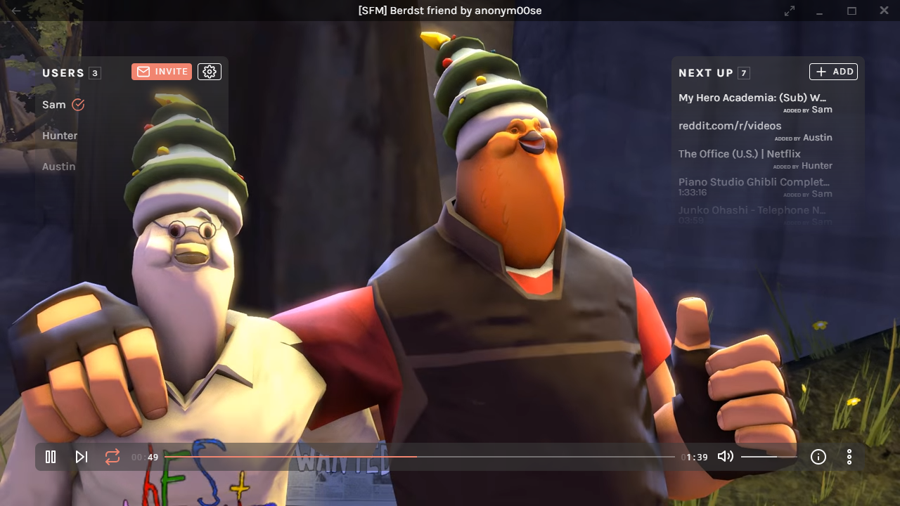
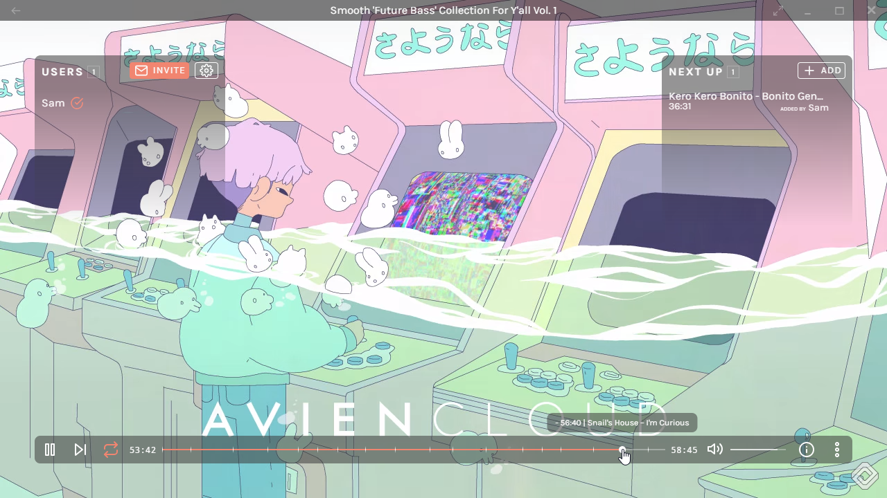
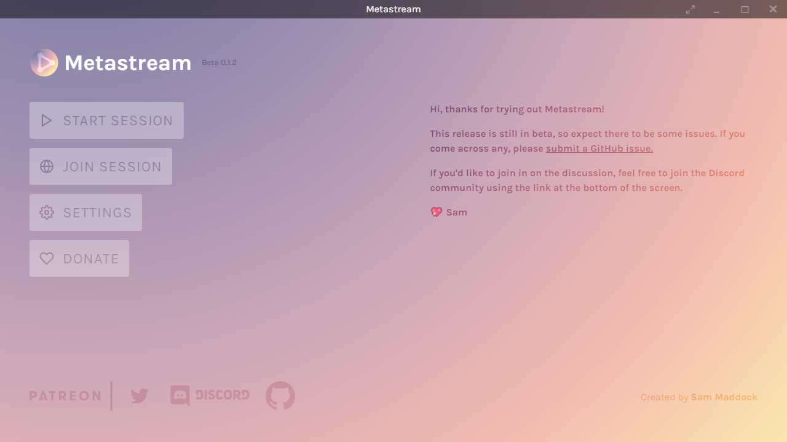

<h1 align="center">
  <br>
  <a href="https://getmetastream.com">
    
  </a>
  <br>
  Metastream
  <br>
  <br>
</h1>

<h4 align="center">Watch streaming media with friends.</h4>

<p align="center">
  <a href="https://discord.gg/nfwPRb9"></a>
  <a href="https://www.patreon.com/metastream"></a>
	<a href="https://github.com/samuelmaddock/metastream/releases"></a>
</p>

## Features

- Runs on Windows and macOS.
- Synchronized playback of streaming media across various websites.
- Public, private, and offline sessions.
- Support for P2P (WebRTC) and Direct IP (WebSocket) connections.
	- P2P uses [swarm-peer-server](https://github.com/samuelmaddock/swarm-peer-server) with 64-character hex public keys, called "friend codes".
	- Both P2P and Direct IP use client-server architecture.
- Real-time chat with peers.
- Queue of media requested by peers in session.
- [Timestamp cue points](./resources/screenshots/screenshot2.png) parsed from media description.
- Auto-fullscreen of embedded media players on websites.
- Per-user playback permissions, managed by the host.
- Basic host administrative functionality (kicking peers).
- Partial [support for Chrome Extensions](./docs/extensions.md).

## Install

### Recommended Install

Download the latest version of Metastream from
[the official website](https://getmetastream.com).

### Advanced Install

- Download specific installer files from the [GitHub releases](https://github.com/samuelmaddock/metastream/releases) page.

- Try the (unstable) development version by cloning the Git repository. See the
  ["How to Contribute"](#how-to-contribute) instructions.

## Screenshots







## Questions

### Why Electron and not a web app?

There were two main designs goals in mind while building Metastream.
1. Support most media streaming websites.
1. Make networking resiliant in case any backend services go down. 

#### Supporting websites

tl;dr: Electron is more flexible.

To synchronize media on websites, there are two options: use a public API provided by the service OR inject scripts to interact with the media player.

In [past](https://github.com/pixeltailgames/cinema) [projects](https://github.com/samuelmaddock/gm-mediaplayer) I used public APIs. This works great for a few websites, but it doesn't scale well since most don't have an API or requires a lot more effort.

To inject scripts into a website, **a [browser extension](https://developer.chrome.com/extensions) is required**. If Metastream were a web app, it would require browser extensions for each vendor (Chrome, Firefox, Edge, etc.). On top of this, there's a history of extensions getting removed from vendor stores without an available recourse.

Browser extensions can [inject scripts deeply](https://developer.chrome.com/extensions/content_scripts#frames) in nested [iframes](https://developer.mozilla.org/en-US/docs/Web/HTML/Element/iframe). This is necessary for **websites that embed external media players** such as YouTube embeds.

Auto-fullscreen is a feature in Metastream in which video players on a webpage are enlarged to take up the full application frame. This required some trickery with injecting mouse clicks to trigger user gestures, something not possible with a browser extension.

Ultimately Electron gives more flexibility to interact with webpages to help make all web streaming media better supported.

#### Making it resiliant

Most web apps typically provide only one way to connect to peers—using their proprietary backend service. If it ever goes down, you can no longer use the web app.

By using Electron, I provide **two ways to connect to peers**: WebRTC, prone to downtime, and Websockets, always available for Direct IP connections.

In the future, I'd like to investigate adding more ways to connect with friends such as using [Discord's Rich Presence](https://discordapp.com/developers/docs/rich-presence/how-to) features.

## How to Contribute

### Get the code

```
$ git clone https://github.com/samuelmaddock/metastream.git
$ cd metastream
$ yarn
```

### Run the app

```
$ yarn dev

# Open multiple instances for local network testing
$ NUM_WINDOWS=2 yarn dev
```

### Package the app

Builds app binaries for the host architecture.

```
$ yarn package
```

### Build notes

The version of Electron used in the release app depends on a fork which is not yet automatically used in the current build process. It can be manually downloaded from [samuelmaddock/muon](https://github.com/samuelmaddock/muon/releases). Once downloaded, place the ZIP into `~/.electron`
